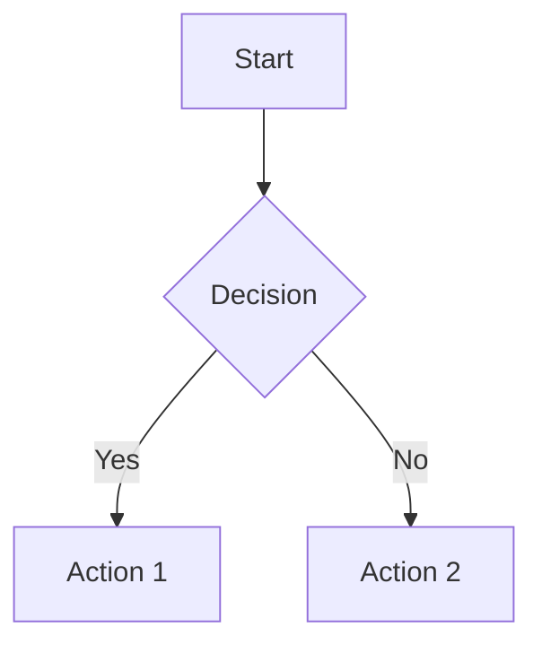

# Markdown Guide for Chirpy: Writing Better Blog Posts

When writing blog posts with the Chirpy Jekyll theme, you have access to a rich set of Markdown features that can make your content more engaging and professional. This guide will walk you through the key formatting options available in Chirpy, with practical examples you can use in your posts.

## Headings

Use headings to structure your content hierarchically. Chirpy supports standard Markdown headings:

```markdown
# H1 — Main Title (usually reserved for the post title)
## H2 — Section Heading
### H3 — Subsection
#### H4 — Sub-subsection
```

**Tip:** H1 is typically used only once at the top. Start your sections with H2.

## Paragraphs and Text Formatting

Write your content in normal paragraphs. Chirpy handles typography beautifully:

```markdown
This is a regular paragraph. You can use *italics* or **bold** text easily.
For `inline code`, wrap it in backticks.
```

## Lists

### Ordered Lists
Perfect for step-by-step instructions:

```markdown
1. First step
2. Second step
3. Third step
```

### Unordered Lists
Great for bullet points:

```markdown
- Item one
- Item two
  - Nested item
- Item three
```

### Task Lists
Useful for tutorials or checklists:

```markdown
- [x] Completed task
- [ ] Pending task
- [x] Another completed item
```

## Block Quotes

Use block quotes for highlighting important information or citations:

```markdown
> This is a block quote. It's great for emphasizing key points or quoting sources.
```

## Prompts (Callouts)

Chirpy supports special prompt boxes for different types of messages. These are perfect for warnings, tips, and important notes:

### Tip Prompt
```markdown
> This is a helpful tip!
{: .prompt-tip }
```

> This is a helpful tip!
{: .prompt-tip }

### Info Prompt
```markdown
> Here's some important information.
{: .prompt-info }
```

> Here's some important information.
{: .prompt-info }

### Warning Prompt
```markdown
> Be careful with this important warning!
{: .prompt-warning }
```

> Be careful with this important warning!
{: .prompt-warning }

### Danger Prompt
```markdown
> This indicates a dangerous or critical situation.
{: .prompt-danger }
```

> This indicates a dangerous or critical situation.
{: .prompt-danger }

## Tables

Create tables for comparing options or displaying data:

```markdown
| Feature | Description | Status |
|---------|-------------|--------|
| Tables | Easy to create | ✅ |
| Formatting | Markdown style | ✅ |
| Responsive | Works on mobile | ✅ |
```

| Feature | Description | Status |
|---------|-------------|--------|
| Tables | Easy to create | ✅ |
| Formatting | Markdown style | ✅ |
| Responsive | Works on mobile | ✅ |

## Links

Add links to external resources:

```markdown
[Link text](https://example.com)
```

Or use automatic links:
```markdown
<https://example.com>
```

## Footnotes

Add references or additional information at the bottom of your post:

```markdown
This is the main text with a footnote[^1].

[^1]: This is the footnote content that appears at the bottom.
```

This is the main text with a footnote[^1].

## Code

### Inline Code
For short code snippets within text:

```markdown
Use `console.log()` for debugging.
```

### Code Blocks
For longer code examples with syntax highlighting:

````markdown
```javascript
function helloWorld() {
  console.log("Hello, World!");
}
```
````

```javascript
function helloWorld() {
  console.log("Hello, World!");
}
```

### File Paths
Highlight file paths specially:

```markdown
The config file is located at `/path/to/config.yml`{: .filepath}.
```

The config file is located at `/path/to/config.yml`{: .filepath}.

## Mathematics

Chirpy supports MathJax for mathematical expressions. Enable it in your post front matter with `math: true`:

```yaml
---
math: true
---
```

Then use LaTeX syntax:

```latex
$$
\sum_{n=1}^\infty \frac{1}{n^2} = \frac{\pi^2}{6}
$$
```

$$
\sum_{n=1}^\infty \frac{1}{n^2} = \frac{\pi^2}{6}
$$

## Diagrams with Mermaid

Create diagrams using Mermaid. Enable it with `mermaid: true` in front matter:

```yaml
---
mermaid: true
---
```




## Images

### Basic Images
```markdown

```

### Images with Captions
```markdown

_Caption text here_
```

### Responsive Images
```markdown
{: width="400" height="300" .w-75}
```

### Floating Images
```markdown
{: .w-50 .left}
Text that wraps around the left-aligned image.
```

{: .w-50 .left}
This text demonstrates how content flows around a left-aligned image. The image is sized to 50% width and floats to the left, allowing text to wrap around it naturally.

### Theme-Aware Images
```markdown
{: .light}
{: .dark}
```

## Videos

Embed YouTube videos using the include tag:

```markdown

```

Replace `VIDEO_ID` with the actual YouTube video ID from the URL.

## Best Practices

1. **Front Matter**: Always include proper front matter at the top of your posts:
   ```yaml
   ---
   title: "Your Post Title"
   date: YYYY-MM-DD HH:MM:SS +0000
   categories: [Category1, Category2]
   tags: [tag1, tag2]
   ---
   ```

2. **Enable Features**: Add `math: true` or `mermaid: true` to front matter when using those features.

3. **Image Optimization**: Use appropriate image sizes and consider lazy loading.

4. **Accessibility**: Always include alt text for images and meaningful link text.

5. **Mobile-Friendly**: Test your posts on different screen sizes.

This guide covers the most commonly used features in Chirpy. Experiment with these elements to create engaging, well-formatted blog posts. Remember to preview your posts locally using `bundle exec jekyll serve` before publishing!

[^1]: This is an example footnote that demonstrates the footnote feature in Chirpy.