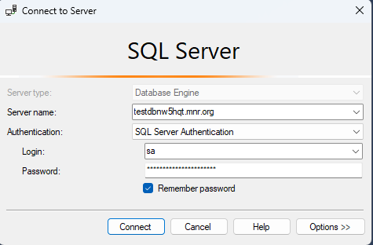
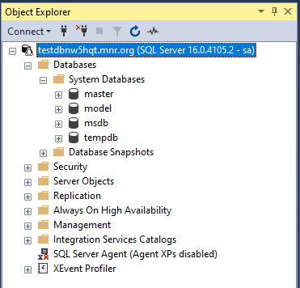
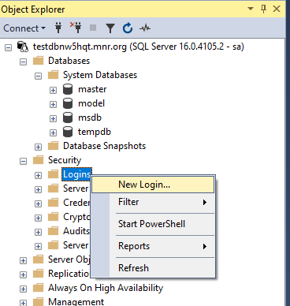
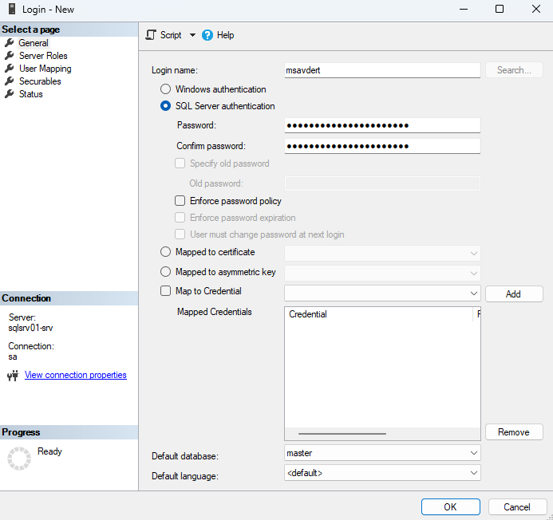
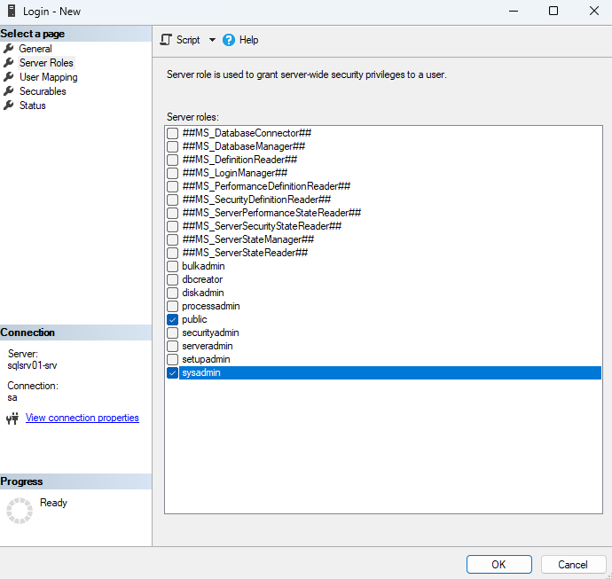
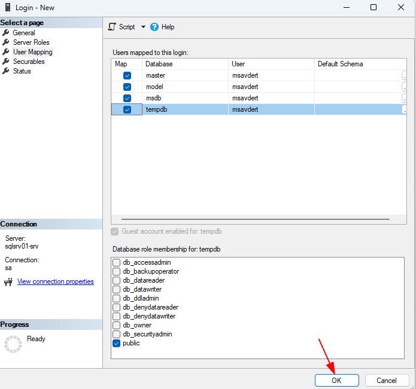
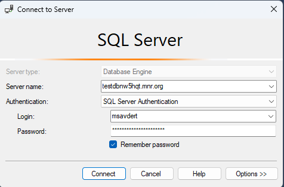
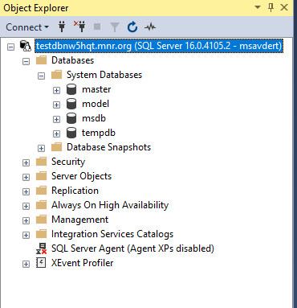
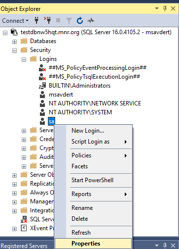
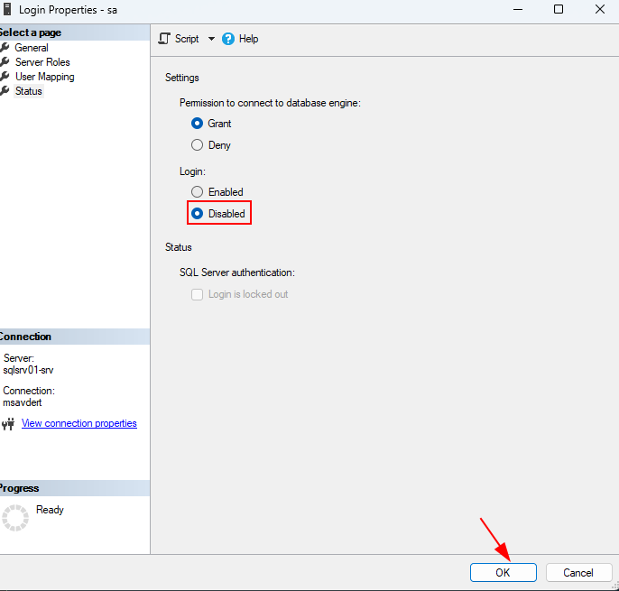

## Prerequisites

You must have a RHEL 8.x machine with at least 2 GB of memory.

## Install SQL Server

To configure SQL Server on RHEL 9, run the following commands in a terminal to install the mssql-server package:

1. Download the SQL Server 2022 (16.x) Red Hat 9 repository configuration file:

```bash
sudo curl -o /etc/yum.repos.d/mssql-server.repo https://packages.microsoft.com/config/rhel/9/mssql-server-2022.repo
```

2. Run the following command to install SQL Server:

```bash
sudo dnf install -y mssql-server
```

3. After the package installation finishes, run mssql-conf setup using its full path, and follow the prompts to set the SA password and choose your edition. As a reminder, the following SQL Server editions are freely licensed: Evaluation, Developer, and Express.

```bash
sudo /opt/mssql/bin/mssql-conf setup
```

```text
Choose an edition of SQL Server:
  1) Evaluation (free, no production use rights, 180-day limit)
  2) Developer (free, no production use rights)
  3) Express (free)
  4) Web (PAID)
  5) Standard (PAID)
  6) Enterprise (PAID) - CPU core utilization restricted to 20 physical/40 hyperthreaded
  7) Enterprise Core (PAID) - CPU core utilization up to Operating System Maximum
  8) I bought a license through a retail sales channel and have a product key to enter.
  9) Standard (Billed through Azure) - Use pay-as-you-go billing through Azure.
 10) Enterprise Core (Billed through Azure) - Use pay-as-you-go billing through Azure.

Details about editions can be found at
https://go.microsoft.com/fwlink/?LinkId=2109348&clcid=0x409

Use of PAID editions of this software requires separate licensing through a
Microsoft Volume Licensing program.
By choosing a PAID edition, you are verifying that you have the appropriate
number of licenses in place to install and run this software.
By choosing an edition billed Pay-As-You-Go through Azure, you are verifying
that the server and SQL Server will be connected to Azure by installing the
management agent and Azure extension for SQL Server.

Enter your edition(1-10): __2__
The license terms for this product can be found in
/usr/share/doc/mssql-server or downloaded from: https://aka.ms/useterms

The privacy statement can be viewed at:
https://go.microsoft.com/fwlink/?LinkId=853010&clcid=0x409

Do you accept the license terms? [Yes/No]:<mark>Yes</mark>

Enter the SQL Server system administrator password: ***********
Confirm the SQL Server system administrator password: ***********
Configuring SQL Server...

ForceFlush is enabled for this instance.
ForceFlush feature is enabled for log durability.
Created symlink /etc/systemd/system/multi-user.target.wants/mssql-server.service → /usr/lib/systemd/system/mssql-server.service.
Setup has completed successfully. SQL Server is now starting.
```

Remember to specify a strong password for the SA account. You need a minimum length 8 characters, including uppercase and lowercase letters, base-10 digits and/or non-alphanumeric symbols.

Once the configuration is done, verify that the service is running:

```bash
systemctl status mssql-server
```

```text
● mssql-server.service - Microsoft SQL Server Database Engine
     Loaded: loaded (/usr/lib/systemd/system/mssql-server.service; enabled; vendor preset: disabled)
     Active: active (running) since Wed 2024-03-06 18:22:37 UTC; 2min 29s ago
       Docs: https://docs.microsoft.com/en-us/sql/linux
   Main PID: 510 (sqlservr)
      Tasks: 216
     Memory: 1.1G
     CGroup: /docker/824c84d9f33826dfb12a3fd040c22da5def01c02c970337e33cc8dff511e18ff/system.slice/mssql-server.service
             ├─510 /opt/mssql/bin/sqlservr
             └─523 /opt/mssql/bin/sqlservr

Mar 06 18:22:40 sqlsrv01-srv sqlservr[523]: [97B blob data]
Mar 06 18:22:40 sqlsrv01-srv sqlservr[523]: [95B blob data]
Mar 06 18:22:40 sqlsrv01-srv sqlservr[523]: [101B blob data]
Mar 06 18:22:40 sqlsrv01-srv sqlservr[523]: [122B blob data]
Mar 06 18:22:40 sqlsrv01-srv sqlservr[523]: [95B blob data]
Mar 06 18:22:40 sqlsrv01-srv sqlservr[523]: [101B blob data]
Mar 06 18:22:40 sqlsrv01-srv sqlservr[523]: [124B blob data]
Mar 06 18:22:40 sqlsrv01-srv sqlservr[523]: [145B blob data]
Mar 06 18:22:45 sqlsrv01-srv sqlservr[523]: [73B blob data]
Mar 06 18:22:45 sqlsrv01-srv sqlservr[523]: [81B blob data]
```

At this point, SQL Server is running on your RHEL machine and is ready to use!






## Disable the sa account as a best practice

When you connect to your SQL Server instance using the sa account for the first time after installation, it's important for you to follow these steps, and then immediately disable the sa login as a security best practice.

1. Create a new login, and make it a member of the sysadmin server role.










2. Connect to the SQL Server instance using the new login you created.





3. Disable the sa account, as recommended for security best practice.





## Install the SQL Server command-line tools

To create a database, you need to connect with a tool that can run Transact-SQL statements on SQL Server. The following steps install the SQL Server command-line tools: sqlcmd utility and bcp utility.

Use the following steps to install the mssql-tools18 on Red Hat Enterprise Linux.

1. Download the Microsoft Red Hat repository configuration file.

For Red Hat 9, use the following command:

```bash
curl https://packages.microsoft.com/config/rhel/9/prod.repo | sudo tee /etc/yum.repos.d/mssql-release.repo
```

2. If you had a previous version of mssql-tools installed, remove any older unixODBC packages.

```bash
sudo yum remove mssql-tools unixODBC-utf16 unixODBC-utf16-devel
```

3. Run the following commands to install mssql-tools18 with the unixODBC developer package.

```bash
sudo yum install -y mssql-tools18 unixODBC-devel
```

{{ < box info >}}
**Note**

To update to the latest version of mssql-tools, run the following commands:

```bash
sudo yum check-update
sudo yum update mssql-tools18
```

{{ < /box >}}

4. Optional: Add /opt/mssql-tools18/bin/ to your PATH environment variable in a bash shell.

To make sqlcmd and bcp accessible from the bash shell for login sessions, modify your PATH in the ~/.bash_profile file with the following command:

```bash
echo 'export PATH="$PATH:/opt/mssql-tools18/bin"' >> ~/.bash_profile
```

To make sqlcmd and bcp accessible from the bash shell for interactive/non-login sessions, modify the PATH in the ~/.bashrc file with the following command:

```bash
echo 'export PATH="$PATH:/opt/mssql-tools18/bin"' >> ~/.bashrc
source ~/.bashrc
```

## Connect locally

The following steps use sqlcmd to locally connect to your new SQL Server instance.

1. Run sqlcmd with parameters for your SQL Server name (-S), the user name (-U), and the password (-P). In this tutorial, you are connecting locally, so the server name is localhost. The user name is sa and the password is the one you provided for the SA account during setup.

```bash
sqlcmd -S localhost -U sa -P '<YourPassword>'
```

{{ < box info >}}
**Note**

Newer versions of sqlcmd are secure by default. For more information about connection encryption, see sqlcmd utility for Windows, and Connecting with sqlcmd for Linux and macOS. If the connection doesn't succeed, you can add the -No option to sqlcmd to specify that encryption is optional, not mandatory.

{{ < /box >}}

You can omit the password on the command line to be prompted to enter it.

If you later decide to connect remotely, specify the machine name or IP address for the -S parameter, and make sure port 1433 is open on your firewall.

2. If successful, you should get to a sqlcmd command prompt: 1>.

4. If you get a connection failure, first attempt to diagnose the problem from the error message. Then review the [connection troubleshooting recommendations](https://learn.microsoft.com/en-us/sql/linux/sql-server-linux-troubleshooting-guide?view=sql-server-ver16#connection).

## Create and query data

The following sections walk you through using sqlcmd to create a new database, add data, and run a simple query.

For more information about writing Transact-SQL statements and queries, see [Tutorial: Writing Transact-SQL Statements](https://learn.microsoft.com/en-us/sql/t-sql/tutorial-writing-transact-sql-statements?view=sql-server-ver16).

### Create a new database

The following steps create a new database named TestDB.

1. From the sqlcmd command prompt, paste the following Transact-SQL command to create a test database:

```sql
CREATE DATABASE TestDB;
```

2. On the next line, write a query to return the name of all of the databases on your server:

```sql
SELECT Name from sys.databases;
```

3. The previous two commands were not executed immediately. You must type GO on a new line to execute the previous commands:

```sql
GO
```

## References

[Quickstart: Install SQL Server and create a database on Red Hat](https://learn.microsoft.com/en-us/sql/linux/quickstart-install-connect-red-hat?view=sql-server-ver16&tabs=rhel8)